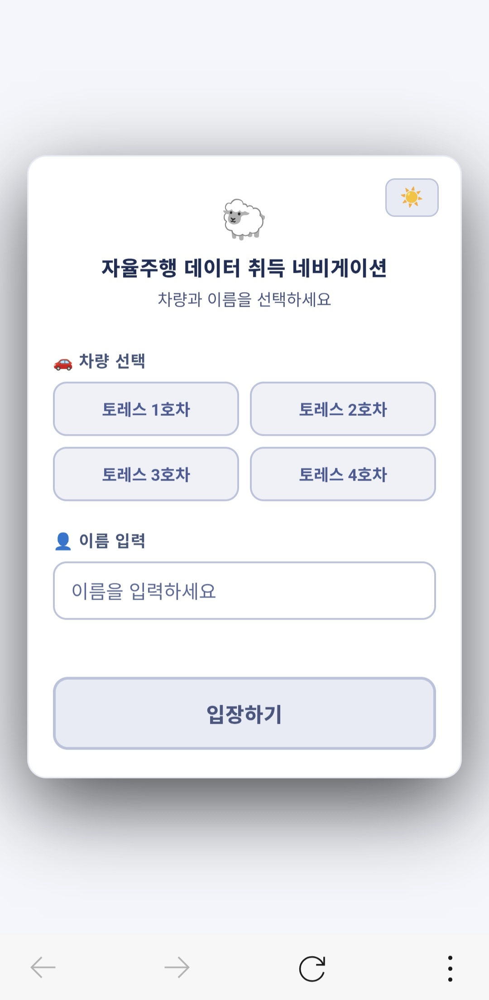
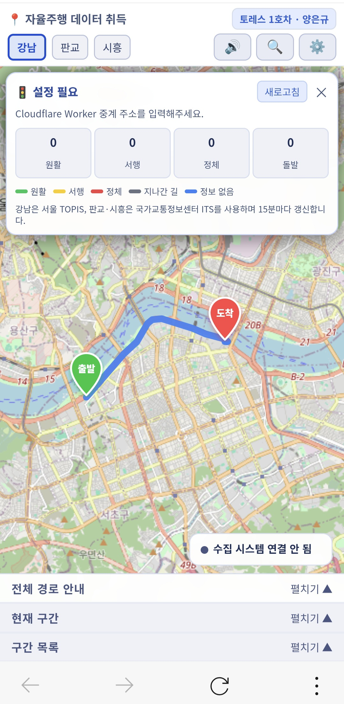

## 📱 사용법

> 처음 켰을 때 위에서부터 순서대로 따라 하면 됩니다.

### 1. 로그인

1. 🚗 **차량 선택** — 토레스 1~4호차 중 본인이 탄 차량 클릭
2. 👤 **이름 입력**
3. **입장하기** 클릭

---

### 2. 화면 한눈에 보기

  
  &nbsp;&nbsp;&nbsp;&nbsp;
  

| 위치 | 이름 | 역할 |
|---|---|---|
| 좌상단 | 지역 버튼 | 강남 / 판교 / 시흥 중 데이터 취득 지역 전환 |
| 우상단 | 🔊 | 음성(턴바이턴) 안내 켜기/끄기 |
| 우상단 | 🔍 | 지도를 출발지로 이동 |
| 우상단 | ⚙️ | 설정 메뉴 (아래 4번 참고) |
| 지도 중앙 | 턴바이턴 박스 | 다음 회전까지 거리·방향 |
| 지도 좌하단 | GPS 상태 | 초록=양호 / 노랑=보통 / 빨강=불량 / 깜빡임=신호 없음 |
| 지도 우하단 | 수집 시스템 상태 | ⚙️에서 IP 설정해야 나타남 (7번 참고) |
| 지도 하단 | 전체 경로 안내 | 출발~도착까지 모든 회전 안내 목록 |
| 우측 패널 | 시나리오/구간 패널 | 시나리오 선택, 재생 컨트롤, 구간 목록 |

---

### 3. 주행 시작하기

1. 좌상단에서 **지역**(강남/판교/시흥) 선택
2. 우측 패널 상단 드롭다운에서 **시나리오** 선택
3. 우측 패널의 **▶ 시작** 버튼 클릭 → GPS가 켜지고 턴바이턴 안내가 시작
4. ◀ / ▶ 버튼으로 구간(leg)을 수동으로 이동할 수 있음
5. 구간이 끝나면 자동으로 다음 구간으로 넘어가고, 완료한 구간은 **구간 목록**에 표시 가능
6. 멈추려면 **⏸ 정지** 선택

> 💡 GPS 권한을 처음 묻는 브라우저 알림이 뜨면 **허용**을 눌러야 안내가 동작함 

---

### 4. ⚙️ 설정 메뉴 한 줄 설명

| 메뉴 | 기능 |
|---|---|
| 🗺️ 네이버 지도 | 현재 지역을 네이버 지도 새 탭으로 열기 |
| 🚦 교통 설정 | 실시간 교통정보 중계 서버(Cloudflare Worker) 주소 설정 |
| 📡 수집 시스템 IP 설정 | 센서 수집 PC 주소 입력 → 지도 우하단에 모니터링 패널 표시 |
| 📥 오늘 기록 다운로드 | 오늘 주행 기록을 엑셀(.csv)로 저장 |
| 🗑️ 오늘 기록 초기화 | 오늘 기록만 삭제 |
| ✏️ 경로 수정 | 출발/도착 지점 드래그, 경유점 추가/삭제 |
| ✎ 시나리오 수정 | 구간 거리·속도·소요시간 직접 수정 |
| 📂 설정 가져오기 / 📤 설정 내보내기 | 수정한 경로·시나리오·기록을 파일로 백업/복원 |
| ☀️ 밝은 화면 모드 | 다크/라이트 테마 전환 |
| 🚪 로그아웃 | 차량·이름 다시 선택 |

---

### 5. 경로/시나리오 수정하기 (관리자용)

- **✏️ 경로 수정**: 켜면 출발(초록 핀)·도착(빨강 핀) 마커를 드래그로 옮길 수 있고, **＋ 경유점** / **－ 경유점** 으로 중간 지점을 추가·삭제할 수 있으며, 다 고치면 **💾 저장**.
- **✎ 시나리오 수정**: 구간별 거리·속도·소요시간 숫자를 직접 입력해서 고칠 수 있음
- 수정한 내용은 **이 브라우저에만** 저장됨. 다른 장비에서도 똑같이 쓰려면 ⚙️ → **📤 설정 내보내기**로 파일을 받아서, 다른 장비에서 **📂 설정 가져오기**로 불러오기

---

### 6. 주행 기록 다운로드

- 주행하면서 완료한 구간은 자동으로 기록됨
- ⚙️ → **📥 오늘 기록 다운로드**를 누르면 오늘 날짜 기록이 CSV(엑셀) 파일로 저장됨
- 기록을 다시 시작하고 싶으면 ⚙️ → **🗑️ 오늘 기록 초기화**.

---

### 7. 📡 수집 시스템 모니터링 (선택 기능)

차량에 센서 데이터 수집 PC([Thanks-to-SOOHEON00](https://github.com/yaaaaangeo/Thanks-to-SOOHEON00))가 같이 켜져 있다면, 주행 중 센서가 제대로 돌고 있는지 nav-app에서 바로 확인할 수 있음

1. 수집 PC에서 백엔드 먼저 실행 (`uvicorn main:app --host 0.0.0.0 --port 8000`)
2. nav-app ⚙️ → **📡 수집 시스템 IP 설정** → `http://수집PC IP:8000` 입력
3. 지도 우하단에 패널이 뜨면 연결 완료

| 색상 | 의미 |
|---|---|
| 🟢 초록 | 전체 센서 정상 |
| 🟡 노랑 | 일부 센서 경고 (드랍/큐 지연) |
| 🔴 빨강 | 센서 끊김 또는 수집 시스템 연결 끊김 |

패널을 탭하면 펼쳐져서 센서별 Hz·드랍 카운트와 현재 세션 기록 용량·디스크 사용률까지 볼 수 있음
자세한 연동 방법은 [INTEGRATION.md](./INTEGRATION.md) 참고

---

### 8. 홈 화면에 앱처럼 설치하기 (PWA)

- **iOS(Safari)**: 공유 버튼 → "홈 화면에 추가"
- **Android(Chrome)**: 우측 상단 메뉴 → "홈 화면에 추가" / "앱 설치"
- 설치하면 인터넷이 끊긴 곳에서도 마지막으로 불러온 지도·시나리오는 그대로 열립니다 (단, 처음 1회는 온라인 상태에서 한 번 열어야 해요).

---
