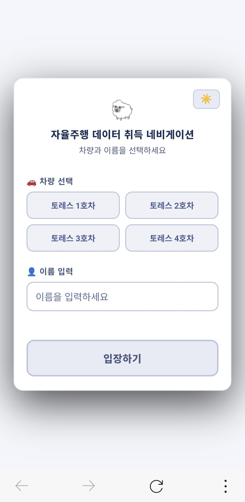
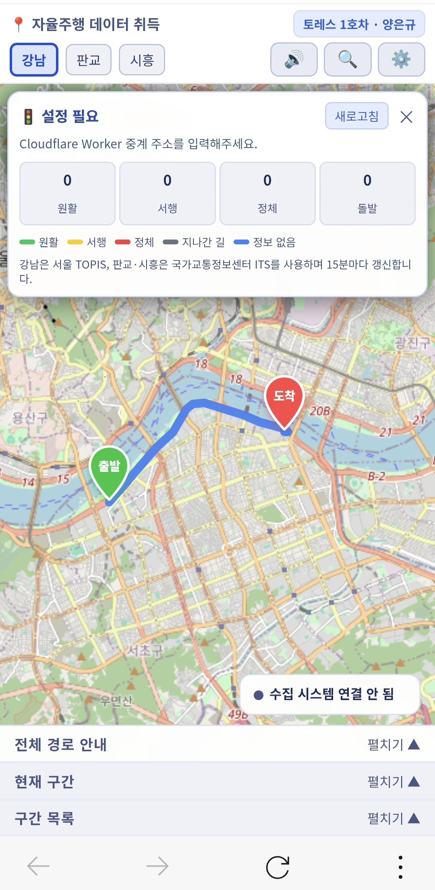

### ver 4.1.0

# 🚗 자율주행 데이터 취득 네비게이션 (nav-app)

> **단일 파일 PWA** — `index.html` 하나로 모든 기능이 동작하는 자율주행 데이터 수집용 내비게이션 앱
---

## 개요

토레스 1~4호차 현장 운전자가 차량 내에서 사용하는 시나리오 기반 내비게이션 앱입니다. 
사전에 정의된 수집 경로를 구간 단위로 안내하며, 주행 기록을 자동으로 저장하고 자율주행 데이터 취득 파이프라인과 연동합니다.

---

## 📱 사용법

> 처음 켰을 때 위에서부터 순서대로 따라 하면 됨

### 1. 로그인

1. 🚗 **차량 선택** — 토레스 1~4호차 중 본인이 탄 차량 클릭
2. 👤 **이름 입력**
3. **입장하기** 클릭

---

### 2. 화면 한눈에 보기

<p align="center">
  
  &nbsp;&nbsp;&nbsp;&nbsp;
  
</p>

| 위치 | 이름 | 역할 |
|---|---|---|
| 좌상단 | 지역 버튼 | 강남 / 판교 / 시흥 중 데이터 취득 지역 전환 |
| 우상단 | 🔊 | 음성(턴바이턴) 안내 켜기/끄기 |
| 우상단 | 🔍 | 지도를 출발지로 이동 |
| 우상단 | ⚙️ | 설정 메뉴 (아래 4번 참고) |
| 지도 중앙 | 턴바이턴 박스 | 다음 회전까지 거리·방향 |
| 지도 좌하단 | GPS 상태 | 초록=양호 / 노랑=보통 / 빨강=불량 / 깜빡임=신호 없음 |
| 지도 우하단 | ◎ 내 위치 | 내 위치로 이동 + **따라가기** 켜기/끄기 (아래 3번 참고) |
| 지도 우하단 | 수집 시스템 상태 | ⚙️에서 IP 설정해야 나타남 (7번 참고) |
| 지도 하단 | 전체 경로 안내 | 출발~도착까지 모든 회전 안내 목록 |
| 우측 패널 | 시나리오/구간 패널 | 시나리오 선택, 재생 컨트롤, 구간 목록 |

---

### 3. 주행 시작하기

1. 좌상단에서 **지역**(강남/판교/시흥) 선택
2. 우측 패널 상단 드롭다운에서 **시나리오** 선택
3. 우측 패널의 **▶ 시작** 버튼 클릭 → GPS가 켜지고 턴바이턴 안내가 시작
4. ◀ / ▶ 버튼으로 구간(leg)을 수동으로 이동할 수 있음
5. 구간이 끝나면 자동으로 다음 구간으로 넘어가고, 완료한 구간은 **구간 목록**에 표시 가능
6. 멈추려면 **⏸ 정지** 선택

> 💡 GPS 권한을 처음 묻는 브라우저 알림이 뜨면 **허용**을 눌러야 안내가 동작함

#### 🧭 내 위치 따라가기 (내비게이션 모드)

- 지도 **우하단 ◎ 버튼**을 누르면 내 위치로 지도가 이동하고 **따라가기**가 켜집니다(파란색 표시).
- 켜져 있으면 주행하는 동안 지도가 **내 위치를 계속 따라오고**, 차량이 화면 중앙보다 **약간 아래**에 놓여 진행 방향 앞쪽을 더 넓게 봅니다(룩어헤드).
- **▶ 시작**을 누르면 따라가기가 자동으로 켜집니다.
- 지도를 손으로 밀면 따라가기가 꺼지고(파란색 해제), 주행 중에는 10초 뒤 자동으로 다시 켜집니다. 언제든 ◎ 버튼을 다시 눌러 재개할 수 있습니다.

---

### 4. ⚙️ 설정 메뉴 한 줄 설명

| 메뉴 | 기능 |
|---|---|
| 🗺️ 네이버 지도 | 현재 지역을 네이버 지도 새 탭으로 열기 |
| 🚦 교통 설정 | 실시간 교통정보 ITS API 인증키 설정 (저장일·만료일 표시) |
| 📥 오늘 기록 다운로드 | 오늘 주행 기록을 엑셀(.xlsx)로 저장 |
| 🗑️ 오늘 기록 초기화 | 오늘 기록만 삭제 |
| ✏️ 경로 수정 | 출발/도착 지점 드래그, 경유점 추가/삭제 |
| ✎ 시나리오 수정 | 구간 거리·속도·소요시간 직접 수정 |
| 📂 설정 가져오기 / 📤 설정 내보내기 | 수정한 경로·시나리오·기록을 파일로 백업/복원 |
| 🔄 경로 기본값으로 초기화 | 이 기기에 저장된 경로 수정본을 지우고 앱 내장 최신 경로로 되돌림 |
| 🌙 어두운 화면 모드 | 다크/라이트 테마 전환 |
| 🚪 로그아웃 | 차량·이름 다시 선택 |

---

### 5. 경로/시나리오 수정하기 (관리자용)

- **✏️ 경로 수정**: 켜면 출발(초록 핀)·도착(빨강 핀) 마커를 드래그로 옮길 수 있고, **＋ 경유점** / **－ 경유점** 으로 중간 지점을 추가·삭제할 수 있으며, 다 고치면 **💾 저장**.
- **✎ 시나리오 수정**: 구간별 거리·속도·소요시간 숫자를 직접 입력해서 고칠 수 있음
- 수정한 내용은 **이 브라우저(기기)에만** 저장됩니다. 다른 장비에서도 똑같이 쓰려면 ⚙️ → **📤 설정 내보내기**로 파일을 받아, 다른 장비에서 **📂 설정 가져오기**로 불러오세요.

#### 🧩 수정본을 "기본값"으로 굳히는 방법 (배포)

이 앱은 켤 때마다 이 기기에 저장된 경로 수정본을 불러와 내장 경로 위에 덮어씁니다. 여러 대의 차량/폰에 손보정한 경로를 공통으로 반영하려면, 수정본을 앱 내장 기본값으로 굽는 것이 확실합니다.

1. 손보정이 끝난 기기에서 ⚙️ → **📤 설정 내보내기** → `nav_settings_YYYYMMDD_HHMM.json` 저장
2. 그 JSON의 좌표·경유점을 `index.html`의 내장 시나리오(`SCENARIOS`)와 `WAYPOINTS`에 반영
3. 새 버전으로 배포 → 모든 기기가 그 경로를 **기본값으로** 표시

> **버전 게이팅**: `index.html`의 내장 버전이 기기에 저장된 버전보다 최신이면, 저장된 옛 수정본은 자동으로 무시하고 내장 기본값을 사용합니다. 즉 새 버전을 배포하면 기기별로 초기화 버튼을 누르지 않아도 새 경로가 뜹니다. 필요하면 ⚙️ → **🔄 경로 기본값으로 초기화**로 언제든 강제 초기화할 수 있습니다.

#### ⚠️ 경로가 의도와 다르게 잡힐 때 — 경유지 활용법

OSRM은 출발→도착 사이 최단/최적 경로를 알아서 계산합니다. 
그런데 실제 도로망에서 출발점에서 도착점까지 가는 방법이 여러 개일 때, OSRM이 판단하기에 우회전으로 돌아가는 게 더 빠르다고 계산하면 그쪽으로 경로를 잡습니다.

경유지를 하나 추가하면 OSRM 입장에서는:

- 기존: 출발 → 도착 (자유롭게 최적 경로 탐색)
- 변경: 출발 → **경유지** → 도착

이렇게 되면 경유지를 반드시 통과해야 하는 제약이 생겨서, 경유지가 좌회전 방향 도로 위에 있으면 OSRM이 그쪽으로 경로를 강제로 꺾게 됩니다. 
경로 모양은 똑같아 보여도 OSRM 내부에서는 완전히 다른 경로 탐색이 일어난 것입니다.

즉, **"이 점은 반드시 지나가"** 라고 못을 박아버리는 방식입니다. 경유지는 반드시 통과해야 할 도로 위에 정확히 찍어야 효과가 있습니다.

---

### 6. 주행 기록 다운로드

- 주행하면서 완료한 구간은 자동으로 기록됨
- ⚙️ → **📥 오늘 기록 다운로드**를 누르면 오늘 날짜 기록이 엑셀(.xlsx) 파일로 저장됨
- 기록을 다시 시작하고 싶으면 ⚙️ → **🗑️ 오늘 기록 초기화**

---

### 7. 📡 수집 시스템 모니터링 (선택 기능)

차량에 센서 데이터 수집 PC가 같이 켜져 있다면, 주행 중 센서가 제대로 돌고 있는지 nav-app에서 바로 확인할 수 있음

1. 수집 PC에서 백엔드 먼저 실행 (`uvicorn main:app --host 0.0.0.0 --port 8000`)
2. nav-app ⚙️ → **📡 수집 시스템 IP 설정** → `http://수집PC IP:8000` 입력
3. 지도 우하단에 패널이 뜨면 연결 완료

| 색상 | 의미 |
|---|---|
| 🟢 초록 | 전체 센서 정상 |
| 🟡 노랑 | 일부 센서 경고 (드랍/큐 지연) |
| 🔴 빨강 | 센서 끊김 또는 수집 시스템 연결 끊김 |

패널을 탭하면 펼쳐져서 센서별 Hz·드랍 카운트와 현재 세션 기록 용량·디스크 사용률까지 볼 수 있음  
자세한 연동 방법은 [INTEGRATION.md](./INTEGRATION.md) 참고

---

### 8. 🚦 교통정보 설정

실시간 교통 상황을 경로 위에 색상으로 표시합니다. 사용하려면 국가교통정보센터(ITS) API 인증키가 필요합니다.

1. ⚙️ → **🚦 교통 설정** 클릭
2. 관리자 비밀번호 입력
3. ITS API 인증키 입력 후 **저장 및 적용**

설정 화면에서 **저장일·만료일·잔여일**을 확인할 수 있으며, 7일 이하로 남으면 빨간색으로 표시됩니다. 
키는 저장 후 **30일이 지나면 자동 만료**되며, 앱을 열 때 만료가 감지되면 기존 키를 완전히 삭제하고 재입력 화면이 자동으로 열립니다.

> ⚠️ ITS API 키는 이 기기 브라우저에만 저장됩니다. GitHub에는 절대 커밋하지 마세요.

---

### 9. 홈 화면에 앱처럼 설치하기 (PWA)

- **iOS(Safari)**: 공유 버튼 → "홈 화면에 추가"
- **Android(Chrome)**: 우측 상단 메뉴 → "홈 화면에 추가" / "앱 설치"
- 설치하면 인터넷이 끊긴 곳에서도 마지막으로 불러온 지도·시나리오는 그대로 열립니다 (단, 처음 1회는 온라인 상태에서 한 번 열어야 해요)

> 💡 새 버전을 배포한 뒤에도 폰에서 옛 화면이 그대로면, 서비스워커 캐시 때문입니다. 브라우저에서 **강력 새로고침**(Ctrl+Shift+R)하거나 설치된 앱을 완전히 종료 후 다시 여세요.

---

## 주요 기능 상세

### 🗺️ 지도 (한국 특화)

- 기본 베이스맵은 **VWorld(국토부 국가지도)** — 한국 도로·건물·산업단지 커버리지가 OSM보다 촘촘합니다.
- 접속 환경에 따라 **VWorld → CARTO Voyager → OSM** 순으로 **자동 폴백**하므로, 특정 지도 서버가 막혀도 지도는 항상 표시됩니다.
- 안정적인 운영을 위해서는 [vworld.kr](https://www.vworld.kr/) 에서 **무료 인증키**를 발급받고 서비스 도메인을 등록한 뒤, `index.html`의 `VWORLD_KEY` 상수에 넣어 공식 WMTS 엔드포인트를 사용하는 것을 권장합니다.

### 🔄 턴바이턴 안내
- 좌회전, 우회전, 직진, 급회전, 유턴, 로터리 등 전 기동 안내
- OSRM `bearing_before/after` 기반 실제 회전 방향 보정
- `turn`, `new name`, `continue` 타입 모두에서 좌/우회전 modifier는 절대 필터링하지 않음
- 500m / 200m / 50m 세 단계 TTS 사전 안내
- 안내 카드에 다음 기동명·도로명 표시
- 경로상 거리 기준 남은 거리 계산 (GPS 투영 오차 보정 포함)

### 📡 GPS 추적 (저사양 태블릿 대응)
- 실시간 GPS 위치 표시 (차량 아이콘 + 진행 방향, GPS 정확도 원)
- **Kalman 필터**로 위치 지터/튐 완화, **이상치 게이트**로 순간이동성 오차 폐기
- **맵매칭(경로 스냅)**: 경로 위에 확실히 있을 때 차량을 도로에 붙여 표시(역주행·평행도로 오스냅 방지)
- **rAF 보간**으로 1Hz 수준 GPS도 도로를 미끄러지듯 부드럽게 이동, 방향 화살표 스무딩
- **내 위치 따라가기(◎)** + 룩어헤드 + 주행용 줌으로 진짜 내비게이션 같은 추종
- 주행 중 지도 조작 시 10초 후 자동으로 추적 재개
- 경로 이탈 감지 (정확도 여유 반영, 임계 초과가 연속될 때 경고)
- 목적지 50m 이내 자동 도착 감지

### 📊 주행 통계
- 실시간 속도, 이동 거리, 예상 잔여 시간 표시
- 구간별 주행 타이머
- 5분 내 휴식 구간 사전 경고

### 📝 주행 기록
- 구간별 출발 시각, 도착 시각, 이동 거리, 평균 속도 자동 기록
- 오늘 기록 다운로드 (XLSX 포맷)
- Discord 웹훅 기반 관리자 알림 (구간 완료 시)

### 🌙 다크/라이트 모드
- 다크 모드 기본, 라이트 모드 토글
- CSS 변수 기반 테마 시스템, 페이지 로드 시 깜빡임(FOUC) 방지

---

## 시나리오 / 세션 ID 체계

수집 경로는 지역별로 3개 시나리오(**ㄹ자 그리드 / M자 그리드 / 링**)로 구성되며, 각 구간(leg)은 아래 규칙의 **세션 ID**를 가집니다.

| 지역 | 세션 ID 예시 | 비고 |
|---|---|---|
| 강남 | `GN-L-BASE-01`, `GN-M-BASE-01`, `GN-RING-BASE-01` | ㄹ자=L / M자=M / 링=RING |
| 시흥 | `SH-L-BASE-01`, `SH-M-BASE-01`, `SH-RING-BASE-01` | 손보정 좌표·경유점 반영 |
| 판교 | (갱신 예정) | 이후 동일 체계로 이관 예정 |

- 시흥 구간은 실차 주행 후 지도에서 손보정한 좌표·경유점이 내장 기본값으로 반영되어 있습니다.
- 강남 구간은 표준 세션 ID로 이관 완료, 상세 경로는 손보정 후 순차 반영합니다.

---

## 기술 스택

| 항목 | 내용 |
|------|------|
| 구조 | 단일 `index.html` (빌드 파이프라인 없음) |
| 지도 | Leaflet.js 1.9.4 |
| 베이스맵 | VWorld(기본) → CARTO Voyager → OSM 자동 폴백 |
| 경로 | OSRM (project-osrm.org, 타임아웃·재시도·캐시) |
| 역지오코딩 | Nominatim |
| 음성 | Web Speech API (TTS) |
| 교통 | 국가교통정보센터 ITS API |
| 엑셀 | SheetJS (xlsx 0.18.5) |
| 배포 | GitHub Pages |
| 데이터 저장 | localStorage (내장 버전 게이팅) |
| PWA | 인라인 base64 아이콘, manifest.json, 서비스워커 |

---

## 연동 구조

```
nav-app (이 앱)
    │
    ├─ VWorld / CARTO / OSM   베이스맵 타일
    ├─ OSRM API              경로 계산
    ├─ Nominatim             역지오코딩
    ├─ ITS API               실시간 교통정보
    ├─ Discord Webhook       관리자 알림
    │
    └─ 자율주행 데이터 취득 파이프라인 (LAN HTTP polling)
           센서 녹화 제어 / L1·L2 검증 / 디코딩
```

`nav-app`과 `자율주행 데이터 취득 파이프라인`은 **코드를 합치지 않고** LAN HTTP 폴링으로만 연동합니다.

---

## 주의사항

### 지도 커버리지 / VWorld 키
기본 지도는 무설정 VWorld 엔드포인트로 즉시 동작하지만, 간헐적으로 제한될 수 있습니다. 안정적 운영을 위해 vworld.kr에서 무료 인증키를 발급받고 도메인을 등록한 뒤 `VWORLD_KEY`에 넣으세요.

### localStorage 용량 / 버전 게이팅
모든 상태(시나리오, 주행 기록, 설정 등)는 localStorage에 저장됩니다. 브라우저에 따라 5~10MB 제한이 있으며, 오래된 기록은 주기적으로 초기화하세요. 내장 버전이 저장본보다 최신이면 저장된 경로 수정본은 자동으로 무시됩니다(⚙️ → 🔄 로 강제 초기화 가능).

### GPS 정확도
실내 또는 고가도로 하부 등 GPS 음영 지역에서는 위치 오차가 커질 수 있습니다. Kalman 필터·맵매칭으로 상당 부분 완화되지만, 좌하단 GPS 상태 표시(양호/보통/불량)를 확인하고 주행하세요.
